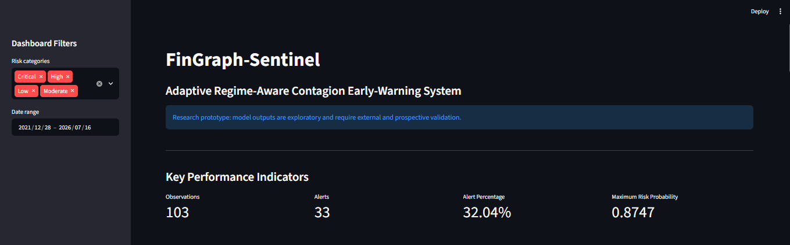
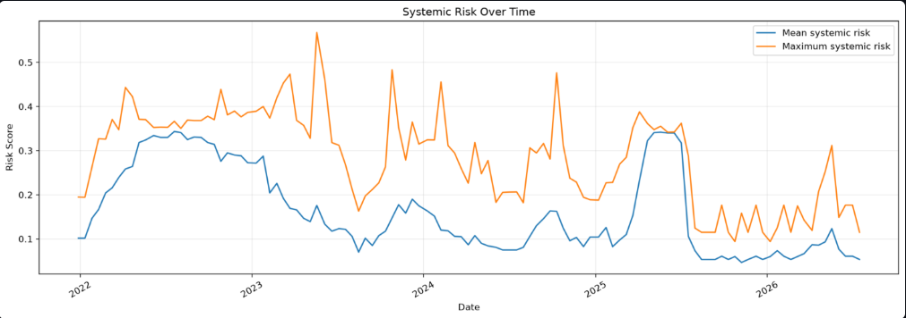
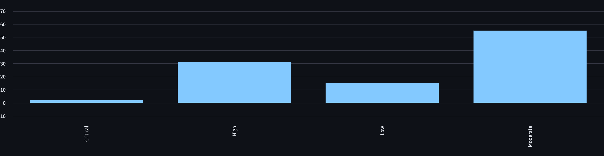
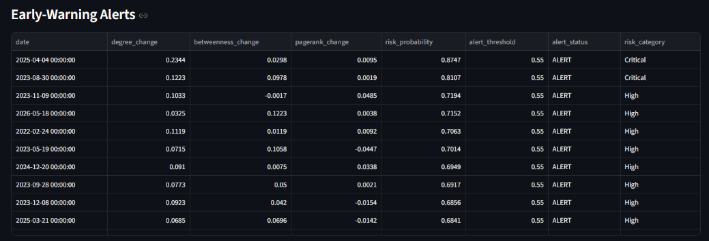
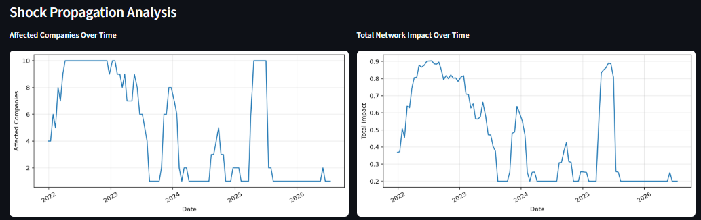

# FinGraph-Sentinel

## Systemic Risk Intelligence Using Financial Graphs

FinGraph-Sentinel is a research-oriented AI/ML project designed to analyze financial networks, identify systemic risk, simulate shock propagation, and develop early-warning signals for financial stress.

The project combines financial network analysis, graph-based metrics, machine learning, and regime-aware validation to study how risk can spread across interconnected companies.

## Key Features

- Dynamic financial network construction
- Systemic risk measurement using network metrics
- Shock propagation simulation
- Crisis regime detection
- Machine learning-based early-warning signals
- Regime-aware and walk-forward validation
- Interactive Streamlit risk dashboard

## Research Pipeline

1. Financial data collection and preprocessing
2. Financial network construction
3. Dynamic systemic risk analysis
4. Shock propagation simulation
5. Crisis regime detection
6. Machine learning-based risk prediction
7. Robustness and temporal validation
8. Full-stack dashboard integration

## Technology Stack

### Programming and Data Science

- Python
- NumPy
- Pandas
- SciPy
- Scikit-Learn
- Matplotlib

### Financial Graph Analysis

- NetworkX
- Graph-based systemic risk metrics
- Dynamic network analysis

### Machine Learning and Deep Learning

- Logistic Regression
- Gradient Boosting
- Random Forest
- PyTorch
- PyTorch Geometric

### Application and Development

- Streamlit
- Git and GitHub
- Jupyter Notebooks
- Docker

## Project Structure

```text
FinGraph-Sentinel/
├── app/
│   └── dashboard/
├── configs/
├── data/
│   ├── raw/
│   ├── processed/
│   └── results/
├── experiments/
├── models/
├── notebooks/
├── outputs/
├── results/
├── src/
│   ├── data/
│   ├── evaluation/
│   ├── graph/
│   ├── models/
│   ├── preprocessing/
│   ├── training/
│   ├── utils/
│   └── visualization/
├── tests/
├── main.py
├── requirements.txt
└── README.md
```

## Dashboard

The project includes an interactive Streamlit dashboard for exploring:

- Systemic risk trends
- Company-level risk
- Risk categories
- Early-warning alerts
- Shock propagation and impact
- Key risk indicators

## Dashboard Screenshots

### Dashboard Overview



### Systemic Risk Analysis



### Risk Category Distribution



### Early-Warning Alerts



### Company Risk and Shock Propagation



## Research and Validation

The project includes temporal validation, walk-forward evaluation, feature-group comparisons, threshold analysis, and robustness testing.

The results are exploratory. Model performance is subject to limitations involving dataset size, validation windows, event frequency, and the availability of representative stress events.

## Installation

Clone the repository:

```bash
git clone https://github.com/vardhanrote/FinGraph-Sentinel.git
cd FinGraph-Sentinel
```

Create and activate a virtual environment:

```bash
python -m venv .venv
```

On Windows PowerShell:

```powershell
.\.venv\Scripts\Activate.ps1
```

Install dependencies:

```powershell
pip install -r requirements-direct.txt
```

For graph deep-learning experiments, use the dedicated GNN environment and requirements.

## Running the Dashboard

From the project root:

```powershell
streamlit run app/dashboard/app.py
```

## Project Status

**Status:** Research and experimental development

Future improvements may include expanded datasets, stronger temporal validation, improved graph-learning methods, and further research evaluation.

## Author

**Vardhan Rote**

BTech Artificial Intelligence and Machine Learning  
Symbiosis Institute of Technology, Pune

[GitHub Repository](https://github.com/vardhanrote/FinGraph-Sentinel)
